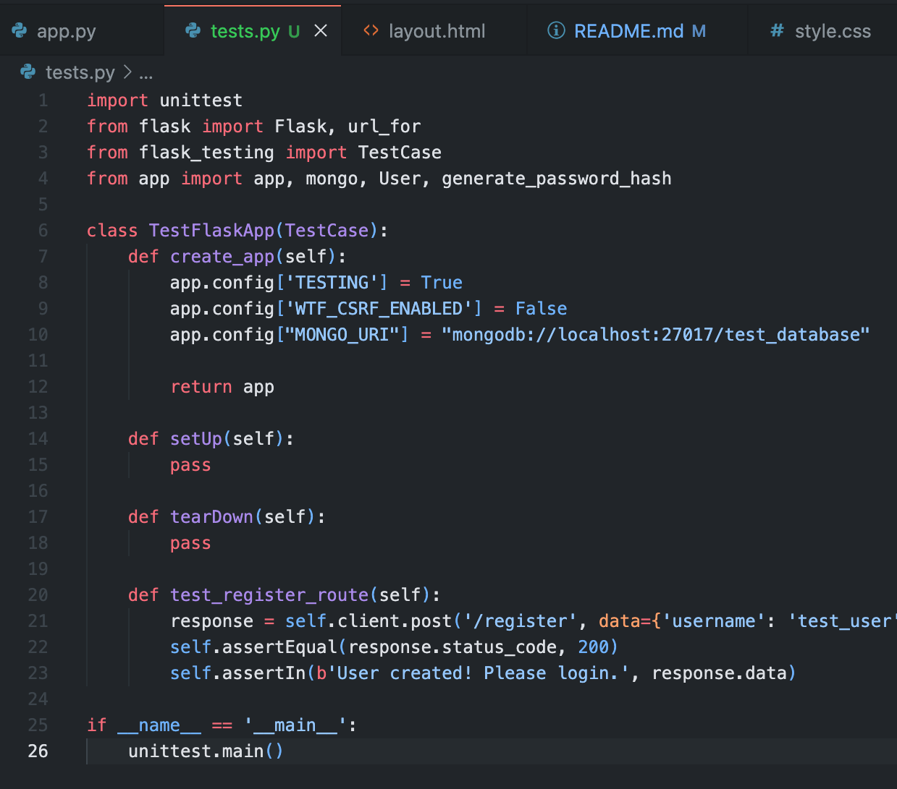
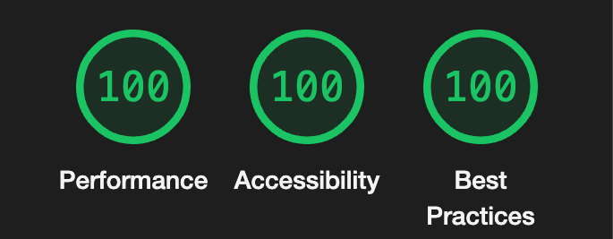
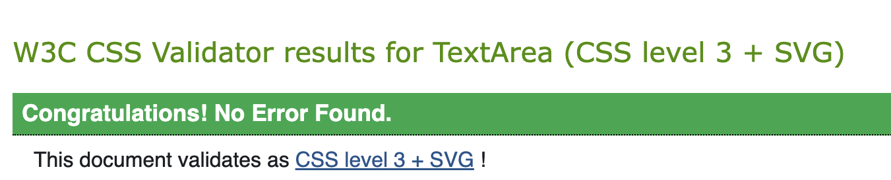
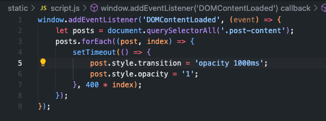
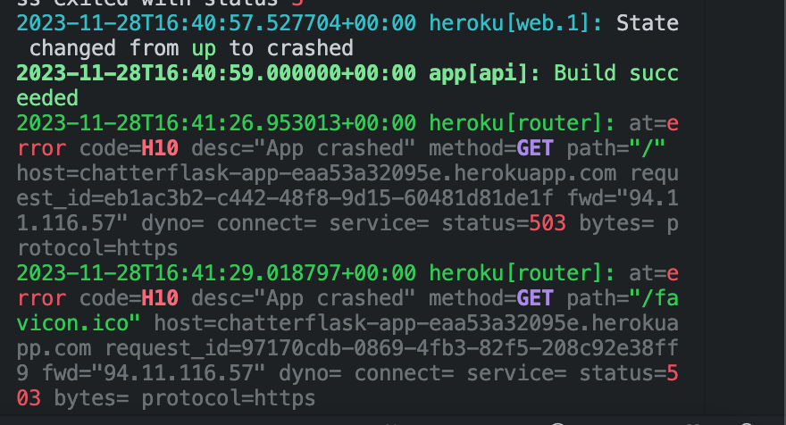
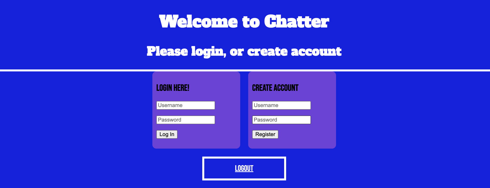

# CHATTER 

**Description:** This application is a blog style posting site, used to demonstrate the features available within a flask application and its uses as a database management system. 

## Table of Contents
1. [Project Description](#project-description)
2. [User Stories](#user-stories)
3. [How To Use](#how-to-use-chatter)
4. [Project Build](#project-build)
5. [Testing Procedures](#testing-procedures)
6. [Technologies Used](#technologies-used)
7. [Acknowledgements](#acknowledgements)
8. [Libraries Used](#libraries-used)
9. [Security Procedures](#security-procedures)

## Project Description

The User is provided with a registration portal which handles a username/password combination and stores the data securely using mongodb-community. Once authorised the user is directed to a dashboard page which provides a post-view section of posts authored by registered users and a post-form section which acts as a submission function for new posts. The front of the application was developed using HTML/CSS with some slight jQuery functionality, using a flask template which is inherited across login page and dashboard page. The back end of the application is written in python using mongodb as a database management system, holding user data such as login material(username/password), posts authored by user, and the ability to delete these posts from the database. 

## User Stories

 **As a registered Chatter user:**
   - I want to log in securely to access personalized features.
   - If non-registered, I want to create a new user profile with secure password hashing. 
   - I want to create, edit, and delete my blog posts.
   - I want to be able to create and remove posts that exist in a secure database.
   - I want to be able to view posts from other registered users.

## How to use Chatter

To use Chatter, simply navigate to the sites login page and create a profile by providing a basic username and password, once registered, submit your user login data and you will be placed within your personal dashboard. Within the dashboard the user can view all posts authored by other registered users as well make their own posts and remove these posts at any time. User data such as username, password, posts and the ability to edit these posts is hosted securely within the mongodb database. 

## Project Build

Building a flask application which could handle user input and registration proved to be a trying task. The inital site design began with drawing the routes for the application on a whiteboard and deciding which best way to provide proof of understanding for handling user data and authetication as well as secure web practices and user friendly design. This began with creating a base html file which extended to an index/login/registration page and once successfully validated, to a dashboard page which recognised users and welcomed them based on their username and allowed post/delete privileges to the database. [HTML Base](./assets/images/basehtml-boilerplate.png)

Once the application had been organised and passed through styling and simple java validation, the next step was to include the mongodb database(community version). Mongodb allows a free tier platform to allow prospective developers to host smaller databases which it handles within its own cloud platform. [mongodb Test](./assets/images/mongodb-post-test.png)

Now that mongodb had been installed and routed correctly, the first post app routes were written to begin adding functionality to the user database. [Posting Python](./assets/images/initial-post-setup.png)

Test posts worked correctly after routing errors had been resolved.
[Mongo Data test](./assets/images/mongodb-post-test.png)

Standard user errors encountered included mishandling of sensitive data such as owner specific mongo-URI, not connecting app routes correctly, forgetting to adjust Procfile or not including a reuirements.txt file. However once these errors had been resolved, the application handled user data as expected and individual users could create read update and delete posts. [CRUD](./assets/images/CRUD-complete-screenshot.png)

Now that user data could be manipulated and consequential steps to ensure that privileged data was removed from public view, it was time to push the application to heroku. The file structure of the application immediately blocked heroku from connecting, and thus ensued a process of backing up files and adding/changing/deleting and rewriting connecting routes to eventually correctly display the mongo data when deployed to the cloud as an application. 

## Security Procedures

The Chatter application incorporates security measures to safeguard user data and control access to sensitive features. Notably, password hashing is employed during user authentication using the generate_password_hash function from Flask's werkzeug.security module. This function ensures the secure storage of hashed passwords in the database, enhancing overall security by preventing the exposure of plain-text passwords in the event of a data breach.

Additionally, Chatter integrates Flask-Login for efficient user session management and access control. The initialization and configuration of the LoginManager ensure a secure handling of user authentication, supported by the definition of the User class and implementation of the load_user function for retrieving user information from the MongoDB database. 

---

## Testing Procedures

Testing procedures for this application include writing custom python tests within a tests.py file which allow the author to take separate functions within the application file and systematically check each feature for bugs, such as testing the user registration route. 

HTML and CSS properties although not a huge feature of understanding within the MS3/Chatter project were tested through tools such as HTML/CSS Validators and Googles Lighthouse testing environment, providing the author with valuable feedback on how to better structure the applications frontend. 

All styles had to pass through the W3C CSS validator and after trial and error passed to expected CSS3 levels.

Although ending as a non prominent feature due to directional constraints, during development any and all javascript functionality was tested, which began with a simple test function to ensure static js files were being accessed within the flask application. 

However, once code testing had finalised, the final hurdle was to deploy successfully to heroku, an application deployment platform. 
 

The final version of Chatter deployed to Heroku at long last and operated as expected, allowing new users to register and create accounts. New and existing users can now view other users posts as well as creating their own content for other users to explore. 

## Technologies Used

- **Flask:** Python web framework for building the backend, posting and security(login) features.
- **HTML/CSS:** Frontend markup and styling.
- **MongoDB Community:** Database management system for storing and retrieving data.
- **Heroku:** Cloud based application deployment system.

## Acknowledgements

- W3 Schools
- Jquery
- W3C HTML/CSS Validator 
- Flask (Used to create templates and handle application data)
- Werkzeug (Security feature used to hash passwords secure data)
- Mongodb/community-edition (Database Management System handling user data such - as posts and user registration)
- Bootstrap
- Heroku (Cloud application deployment platform)
- Google Fonts
- GitHub

## Libraries and Dependencies Used
- OS (built in)
- flask
- flask_login
- flask_pymongo
- pymongo
- bson.objectid (pymongo feature)
- werkzeug.security (security feature included with flask)

## Further information 

Thankyou kindly for using Chatter application! To view this application, visit the url https://chatterflask-app-eaa53a32095e.herokuapp.com/

This project was hosted as repository on Github and is available to be cloned or to be collaborated on by visiting my repository at https://github.com/JoeMille/full-flask

For those wishing to amend and improve, clone or create using Chatter as a template or jumping off point, open your host IDE, enable an integrated terminal and type into the command line= git clone https://github.com/JoeMille/full-flask.git

Once successfully cloned, refer to the libraries and acknowledgment section of the ReadMe! file and install necessary dependencies using the npm install command. 

For those using Mac operating systems make sure to install the home brew software management system. 

Thank you again for taking an interest in Chatter, a custom application built using Python/Flask (preeminently). To contact myself or view further projects, please navigate to my GitHub at https://github.com/JoeMiller 

Alternatively email me directly at jomillah92@icloud.com

